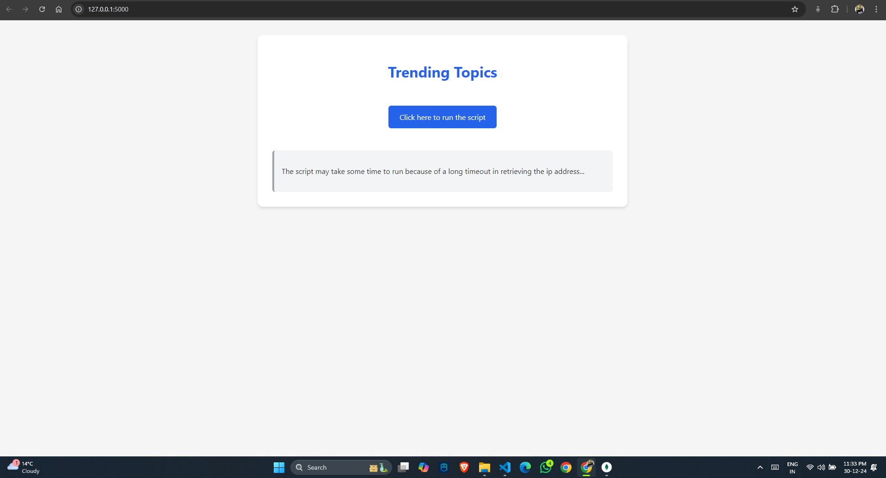
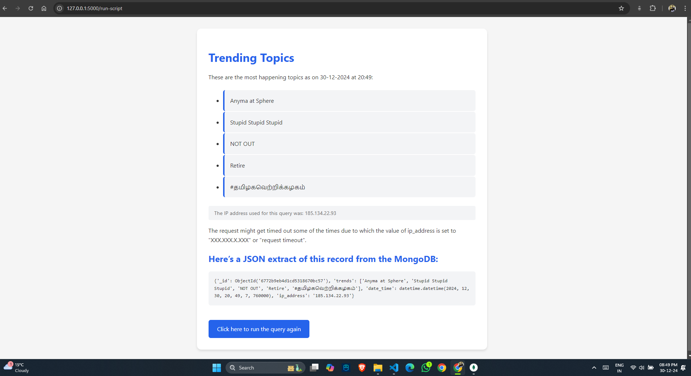

# Trending Data Scraper - X

## HomePage:

<br>
<br>
<br>

## ResultPage:

<br>
<br>
<br>

## Video:
[Project Working Video](https://drive.google.com/file/d/1fLT38dj1jkBKKbFvl62SjI_5MTQMUgzT/view?usp=sharing)


This project fetches trending topics from X (formerly Twitter) using Selenium and displays them on a HTML Page. The data is stored in MongoDB, and the application provides a way to run the scraping script and view the results dynamically.

## Features
- Scrapes trending topics from X using Selenium.
- Displays the scraped data in a user-friendly dashboard.
- Stores data with timestamps and IP address in MongoDB.

## File Structure
- **`app.py`**: The Flask backend for serving the dashboard and running the scraping script.
- **`main.py`**: Contains the Selenium logic for logging into X and scraping trending topics.
- **`.env`**: Stores sensitive configuration data such as MongoDB connection strings and credentials (not included in the repository for security).

## Prerequisites
- Python 3.8 or above
- MongoDB database
- Chrome browser and the corresponding [ChromeDriver](https://sites.google.com/chromium.org/driver/)
- `pip` for managing Python dependencies

## Installation
1. Clone this repository:
   ```bash
   git clone https://github.com/aryanak-18/STIR_Assignment_AryanKumar.git
   cd project
   ```

2. Install required dependencies:
   ```bash
   pip install -r requirements.txt
   ```

3. Set up the `.env` file:
   - Create a `.env` file in the root directory.
   - Add the following variables:
     ```env
     MONGOLINK=<Your MongoDB connection string>
     USERNAME=<Your X username>
     PASSWORD=<Your ProxyMesh password>
     XPASSWORD=<Your X account password>
     ```

4. Download and set up ChromeDriver:
   - Ensure the ChromeDriver executable is in your system's PATH or place it in the project directory.

## Usage
### Start the Flask Application
1. Run the Flask server:
   ```bash
   python app.py
   ```
2. Open a browser and navigate to [http://127.0.0.1:5000](http://127.0.0.1:5000).

### Run the Scraper
- Click the "Run Script" button on the dashboard to scrape the latest trending topics.
- The results will be displayed on the page.

### MongoDB
- Data is stored in the `trending_data` database, under the `trends` collection.

## File Explanations
### `app.py`
- Sets up the Flask application.
- Provides a route (`/`) to serve the home page.
- Implements `/run-script` to trigger the Selenium scraping logic in `main.py`.

### `main.py`
- Uses Selenium to log into X and scrape trending topics.
- Proxies requests to fetch public IP.
- Saves scraped data (trends, IP address, timestamp) in MongoDB.

## Known Issues
- Ensure the `.env` file contains valid credentials for MongoDB and X.
- ChromeDriver version must match the installed Chrome browser.

## Security Notes
- Do not commit the `.env` file to version control.
- Rotate credentials regularly to maintain security.